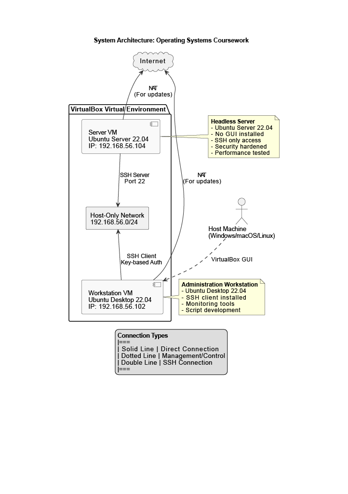
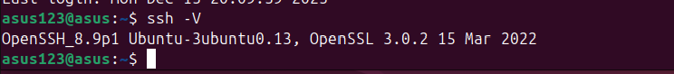
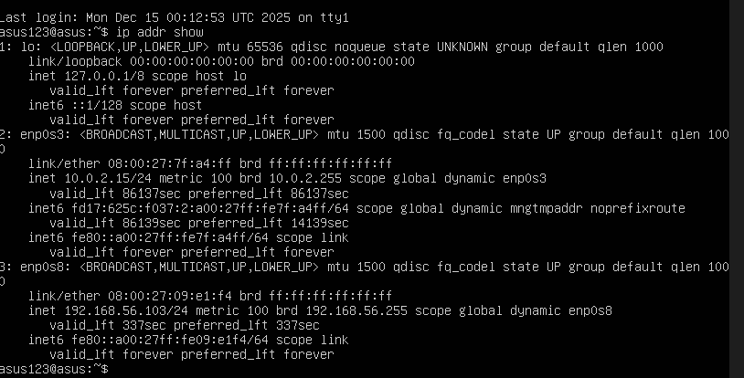
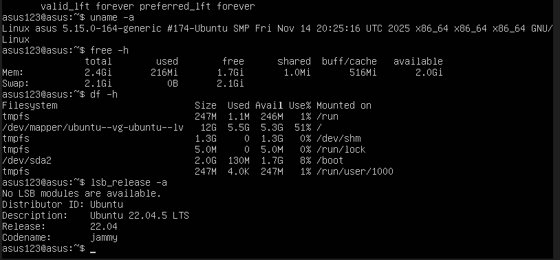

# Week 1: System Planning and Distribution Selection

## 1. System Architecture Diagram


*Figure 1: Dual-VM architecture showing Ubuntu Server and Windows workstation connected via VirtualBox host-only network*

## 2. Distribution Selection Justification

**Chosen Server Distribution: Ubuntu Server 22.04 LTS**

**Comparison with Alternatives:**

| Distribution | Pros for this Project | Cons for this Project | Decision |
| :--- | :--- | :--- | :--- |
| **Ubuntu Server** |  **Vast documentation & community** help for beginners.<br> **Long-Term Support (LTS)** until 2027 ensures stability.<br>**`apt` package manager** has all required tools (SSH, fail2ban, Lynis).<br> **Industry-standard** in cloud/DevOps roles. | Can be slightly more resource-intensive than minimal distros. |  **Selected** |
| **Debian Stable** | Extremely stable and lightweight. | Packages are often older; slower update cycle can hinder testing newer features. | Considered but not chosen. |
| **CentOS Stream / Rocky Linux** | Enterprise-grade security and stability. | Steeper learning curve; less beginner-friendly documentation. | Not chosen for this educational project. |

**Final Justification:** Ubuntu Server 22.04 LTS provides the optimal balance of extensive learning resources, long-term update support, and professional relevance, which is critical for successfully completing all seven weeks of this coursework.

## 3. Workstation Configuration Decision

**Chosen Option: Option B (Host Machine with SSH Client)**

**Configuration Details:**
*   **Host Operating System:** Windows 11
*   **SSH Client:** OpenSSH Client (enabled via Windows Optional Features)
*   **Primary Terminal:** PowerShell
*   **Secondary Terminal:** Git Bash (for Unix-like commands)
*   **Text Editor:** Visual Studio Code

**Justification for Choice:**
1.  **Performance & Simplicity:** No virtual machine overhead on the workstation side frees up system resources (RAM/CPU) for the Server VM.
2.  **Professional Practice:** Directly mirrors real-world scenarios where system administrators connect to remote servers from their local physical machines.
3.  **Ease of Setup:** Leverages the native OpenSSH client in Windows, avoiding the complexity of configuring a second Linux desktop VM.

**Evidence (Screenshot):**

*Figure 2: SSH client version confirmation showing OpenSSH_8.9p1*

## 4. Network Configuration

**VirtualBox Network Settings:**
*   **Server VM Adapter 1:** **NAT** (Provides outbound internet access for updates).
*   **Server VM Adapter 2:** **Host-only Adapter** (Attached to `vboxnet0`).
*   **Purpose:** This creates a private, isolated network (`192.168.56.0/24`) between the host and the server VM for secure SSH communication.

**IP Addressing:**
| System | Interface | Assigned IP | Purpose |
| :--- | :--- | :--- | :--- |
| Ubuntu Server VM | `enp0s8` (Host-only) | `192.168.56.103` | Primary SSH access point. |
| VirtualBox Host | `vboxnet0` | `192.168.56.1` | Default gateway for the host-only network. |

**Command Evidence:**

*Figure 3: Output of `ip addr show` confirming the server's host-only IP address (192.168.56.103)*

## 5. System Specifications

**Server VM Configuration (VirtualBox):**
- **RAM:** 2560 MB (2.5GB)
- **Storage:** 25.0 GB
- **CPUs:** 2 processor cores
- **Network:** NAT + Host-only adapter
- **Display:** Disabled (headless operation)

**Command Output Evidence:**

*Figure 4: Output of system specification commands (`uname`, `free`, `df`, `lsb_release`)*

**Command Results Summary:**

### Kernel Information
```bash
uname -a
Linux asus 5.15.0-164-generic #174-Ubuntu SMP Fri Nov 14 20:25:16 UTC 2025 x86_64 x86_64 x86_64 GNU/Linux

5.2 Memory Usage
bash
free -h
text
               total        used        free      shared  buff/cache   available
Mem:           2.5Gi       216Mi       1.7Gi       1.0Mi       516Mi       2.0Gi
Swap:          2.0Gi       0B          2.0Gi
5.3 Disk Space
bash
df -h
text
Filesystem                         Size  Used Avail Use% Mounted on
tmpfs                              247M  1.1M  246M   1% /run
/dev/mapper/ubuntu--vg-ubuntu--lv   12G  5.5G  5.3G  51% /
tmpfs                              1.3G     0  1.3G   0% /dev/shm
tmpfs                              5.0M     0  5.0M   0% /run/lock
/dev/sda2                          2.0G  130M  1.7G   8% /boot
tmpfs                              247M  4.0K  247M   1% /run/user/1000
5.4 OS Version
bash
lsb_release -a
text
No LSB modules are available.
Distributor ID: Ubuntu
Description:    Ubuntu 22.04.5 LTS
Release:        22.04
Codename:       jammy
```


**6. Learning Reflection**

Key Learnings:

Headless Server Management: Successfully installed and configured Ubuntu Server without a GUI, relying solely on CLI for administration.

VirtualBox Networking: Understood the practical application of NAT (for internet) versus Host-only adapters (for secure internal communication).

SSH Fundamentals: Established secure remote access from a Windows workstation to a Linux server, a core system administration skill.

System Documentation: Utilized CLI tools (uname, free, df, lsb_release, ip) to gather and document comprehensive system specifications.

Technical Journaling: Set up a GitHub Pages site with proper version control to document the learning journey incrementally.

**Challenges Overcome:**

Initial SSH Connection: Required installing and enabling the openssh-server package on the Ubuntu Server.

Network Configuration: Clarified the purpose of multiple network adapters in VirtualBox to ensure both internet access and secure host communication.

Evidence Collection: Learned to take clear terminal screenshots that include both the command and its output for proper documentation.

Conclusion:
Week 1 has successfully established the foundation for this coursework. The Ubuntu Server is installed, accessible via SSH, and fully documented. The architecture supports the secure, remote administration model required for the coming weeks focused on security hardening and performance analysis.

 

