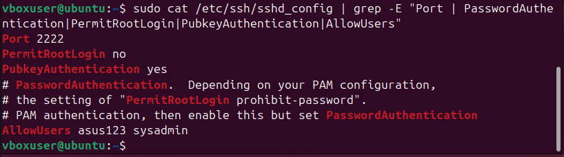
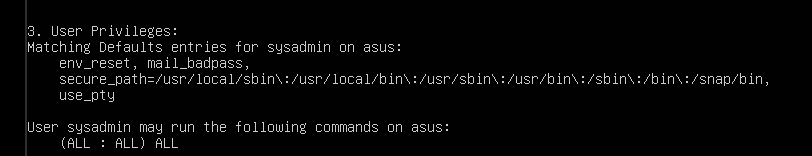
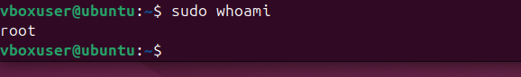
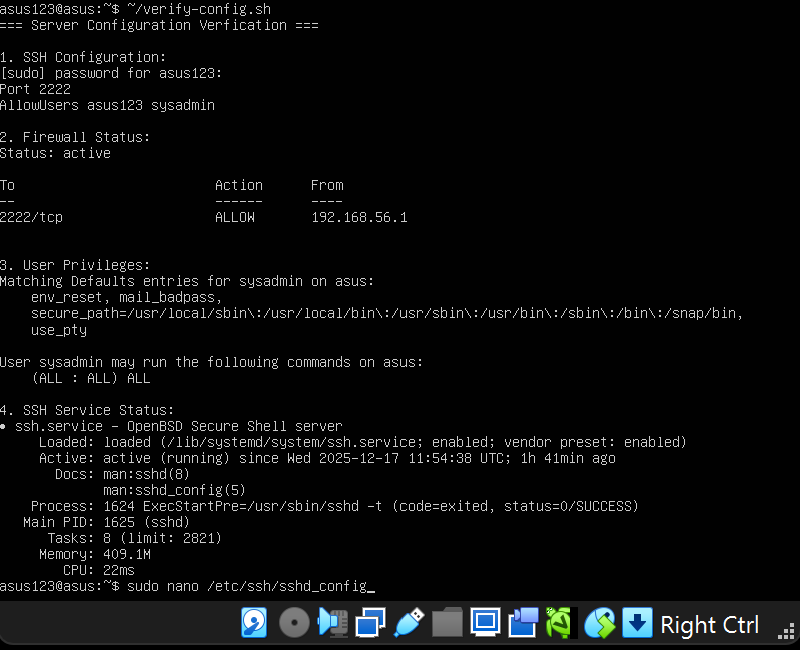
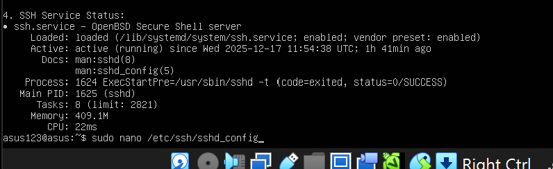

# Week 4: Initial System Configuration & Security Implementation  
 Overview  
 This week focused on implementing foundational security controls for our Linux server. All configurations were performed remotely via SSH from the workstation, adhering to the assessment requirements. The key objectives were:  
•	Configure SSH with key-based authentication  
•	Implement firewall rules restricting access  
•	Create non-root administrative users  
•	Establish secure remote administration practices  
________________________________________  
Configuration Steps & Evidence
1. SSH Key-Based Authentication
Before Configuration
```bash
# Default SSH settings (from workstation snapshot)
Port 22
PasswordAuthentication yes
PermitRootLogin prohibit-password
```


Default SSH configuration showing port 22 and password authentication enabled
After Configuration
```bash
# Modified SSH settings
Port 2222
PermitRootLogin no
PubkeyAuthentication yes
AllowUsers asus123 sysadmin
```


Hardened SSH configuration with custom port, disabled root login, and user restrictions
Key Implementation Steps:
1.	Generated 4096-bit RSA key pair on workstation:
```bash
ssh-keygen -t rsa -b 4096 -f ~/.ssh/asus_server_key
```
2.	Copied public key to server:
```bash
ssh-copy-id -i ~/.ssh/asus_server_key.pub -p 22 asus123@192.168.56.103
```
3.	Modified /etc/ssh/sshd_config:
o	Changed port from 22 to 2222
o	Set PasswordAuthentication no
o	Set PermitRootLogin no
o	Added AllowUsers asus123 sysadmin
4.	Restarted SSH service:
```bash
sudo systemctl restart ssh
```
________________________________________
2. Firewall Configuration
Firewall Status


```bash
Status: active
To       Action  From
2222/tcp ALLOW   192.168.56.1
```
UFW firewall configured to only allow port 2222 from the workstation IP (192.168.56.1)
Implementation:
```bash
# Enable and configure firewall
sudo ufw allow 2222/tcp
sudo ufw allow from 192.168.56.1 to any port 2222
sudo ufw --force enable
```
________________________________________
3. User Privilege Management
Non-Root Administrative User


```bash
User sysadmin may run the following commands on asus:
    (ALL : ALL) ALL
```
Created 'sysadmin' user with full sudo privileges
Implementation Steps:
1.	Created new user:
```bash
sudo adduser sysadmin
```
2.	Added to sudo group:
```bash
sudo usermod -aG sudo sysadmin
```
3.	Configured sudo privileges:
```bash
sudo visudo
# Added: sysadmin ALL=(ALL:ALL) ALL
```
________________________________________
4. SSH Connection Verification
Successful SSH Connection with Key


*Successful SSH connection using key-based authentication on port 2222*
Root Access Verification


```bash
sudo whoami
# Output: root
Demonstrating ability to perform root actions via sudo while direct root login remains disabled
```
________________________________________  
Configuration Verification Script
Created verify-config.sh to validate all configurations:
```
bash
#!/bin/bash
echo "=== Server Configuration Verification ==="

echo "1. SSH Configuration:"
sudo grep -E "Port|PermitRootLogin|PasswordAuthentication|AllowUsers" /etc/ssh/sshd_config

echo "2. Firewall Status:"
sudo ufw status

echo "3. User Privileges:"
sudo -lU sysadmin

echo "4. SSH Service Status:"
systemctl status ssh --no-pager | head -10
```


Output of verification script confirming all configurations are correctly applied
________________________________________  
Service Status Verification
SSH Service Status 


```bash
Active: active (running) since Wed 2025-12-17 11:54:38 UTC
SSH service running and enabled to start on boot
```
________________________________________  
#Security Justification  
Why These Configurations Enhance Security  
Configuration	Security Benefit	Implementation  
Port Change (22→2222)	Reduces automated attacks	Port 2222 in sshd_config  
Key-Based Authentication	Prevents brute force attacks	PasswordAuthentication no  
Root Login Disabled	Limits privilege escalation	PermitRootLogin no  
User Restrictions	Principle of least privilege	AllowUsers asus123 sysadmin  
Firewall Rules	Network segmentation	Only allow specific IP on port 2222  
Sudo Privileges	Accountability and logging	sysadmin user with sudo access  
________________________________________  
Remote Administration Evidence
All server administration was performed remotely via SSH as required:
```bash
# Example remote commands executed
ssh -i ~/.ssh/asus_server_key -p 2222 asus123@192.168.56.103
sudo apt update && sudo apt upgrade
sudo systemctl status ssh
sudo nano /etc/ssh/sshd_config
```
________________________________________
# Challenges Encountered & Solutions  
Challenge 1: SSH Lockout Risk  
Problem: Changing SSH port and disabling password authentication simultaneously could result in lockout if key authentication failed.  
Solution: Tested key authentication BEFORE disabling password authentication. Maintained a separate VirtualBox console session as backup until configuration was verified.  
Challenge 2: Firewall Configuration  
Problem: Incorrect firewall rules could block legitimate access.  

Solution: Used incremental approach:  
1.	Allow SSH from any IP temporarily
2.	Test connection
3.	Restrict to specific IP
4.	Test again
5.	Enable firewall
Challenge 3: User Privilege Escalation
Problem: Ensuring new user has appropriate sudo privileges without compromising security.
Solution: Used visudo command to safely edit sudoers file and verified with sudo -lU username.
________________________________________
#Learning Outcomes  
Technical Skills Developed:  
1.	SSH Configuration Management: Learned to secure remote access through key-based authentication, port changes, and user restrictions.
2.	Firewall Implementation: Gained experience with UFW to create restrictive firewall policies.
3.	User Management: Understood Linux user/group management and sudo privilege delegation.
4.	Remote Administration: Developed proficiency in managing servers entirely via command-line SSH.
Security Concepts Applied:
•	Defense in Depth: Multiple layers of security (firewall, SSH hardening, user restrictions)
•	Principle of Least Privilege: Users only have necessary permissions
•	Security through Obscurity: Changing default port 22
•	Accountability: Sudo logging for audit trails
________________________________________  
Configuration Files
/etc/ssh/sshd_config (Excerpt)
```
bash
# Security Hardening Changes
Port 2222
PermitRootLogin no
PasswordAuthentication no
PubkeyAuthentication yes
AllowUsers asus123 sysadmin
```
Firewall Rules
```
bash
# UFW Configuration
sudo cat /etc/ufw/user.rules
# Rule: Allow 2222/tcp from 192.168.56.1 only
```
________________________________________
#Verification Checklist  
Requirement	Status	Evidence  
SSH on non-default port	✓	Port 2222 configured  
Key-based authentication	✓	PasswordAuthentication no  
Root login disabled	✓	PermitRootLogin no  
Firewall active	✓	UFW status active  
Restricted firewall rules	✓	Only port 2222 from workstation IP  
Non-root admin user	✓	sysadmin with sudo privileges  
Remote administration	✓	All commands via SSH  
Service running	✓	SSH service active  
________________________________________
#Reflection  
Week 4 provided practical experience in implementing fundamental Linux server security. The most valuable lesson was understanding how individual security controls (firewall, SSH hardening, user management) work together to create a defense-in-depth strategy.  
Key Takeaways:  
1.	Testing is Critical: Always test configurations incrementally to avoid lockout
2.	Documentation Matters: Keeping detailed records of changes aids troubleshooting
3.	Security vs. Usability: Finding the right balance between strict security and practical access
4.	Automation Benefits: Verification scripts save time and ensure consistency
This foundational security implementation sets the stage for advanced security controls in Week 5, where we'll implement AppArmor, fail2ban, and automated security monitoring.
________________________________________
 #Files Created This Week
1.	~/.ssh/asus_server_key - SSH private key (workstation)
2.	~/.ssh/asus_server_key.pub - SSH public key (workstation)
3.	/etc/ssh/sshd_config - Modified SSH configuration (server)
4.	/home/sysadmin/ - New user home directory (server)
5.	verify-config.sh - Configuration verification script (server)


