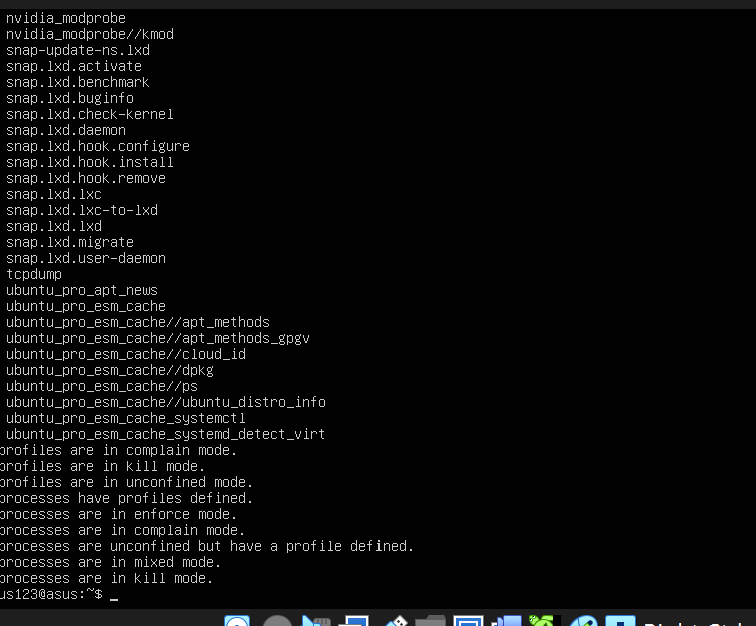
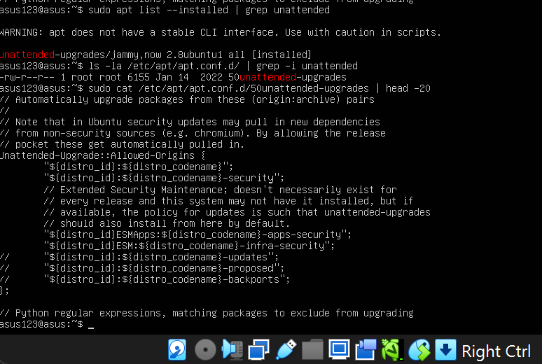
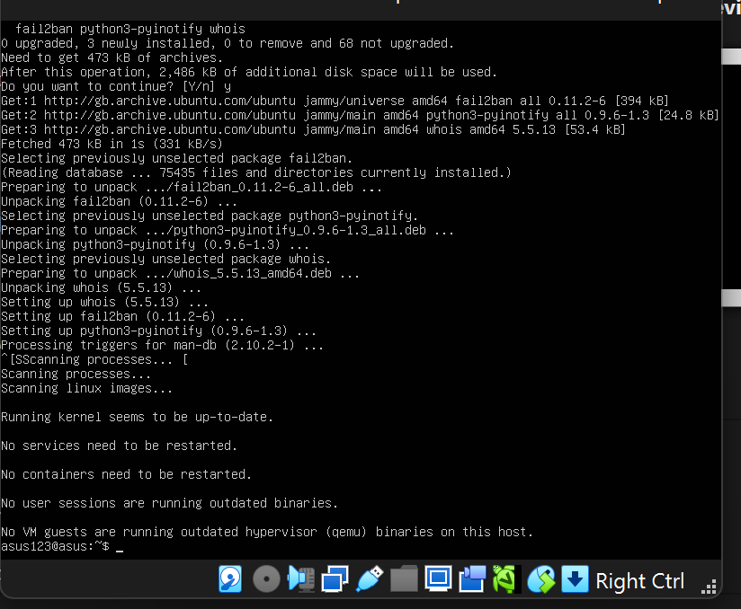
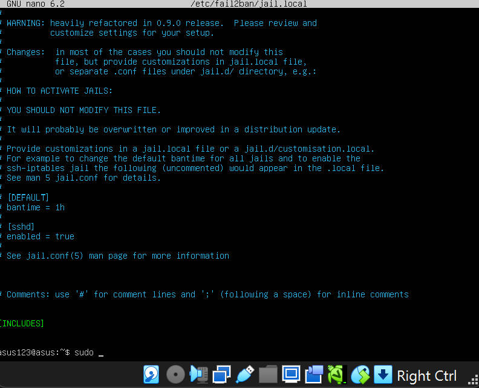
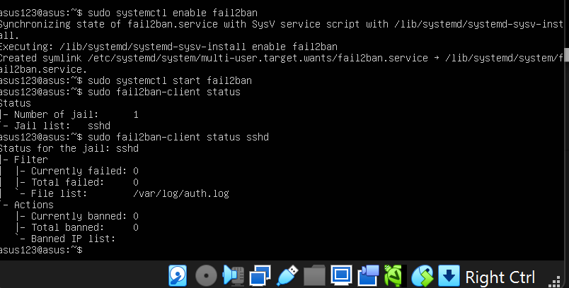
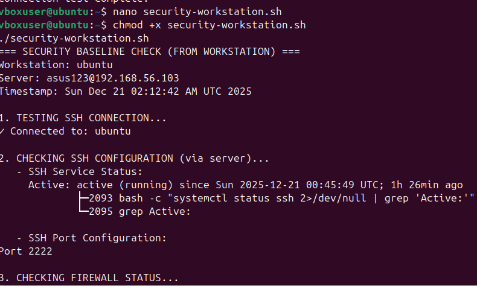
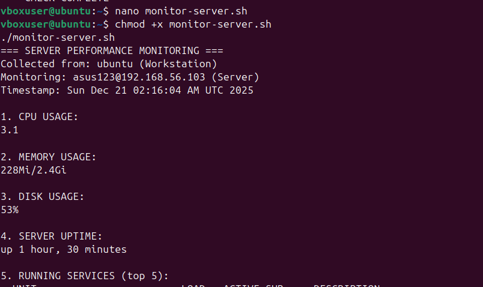

# Week 5: Advanced Security and Monitoring Infrastructure  

# Overview  
This week focused on implementing advanced security controls and developing monitoring capabilities for the Linux server. The tasks included configuring mandatory access control (AppArmor), setting up automatic security updates, implementing intrusion detection with fail2ban, and creating two essential scripts for security verification and remote monitoring.

# 1. Access Control Implementation (AppArmor)  
AppArmor was configured to enforce mandatory access control policies. The status was verified to ensure profiles were active and in the correct mode.  

Command executed on server:  
```
bash
sudo apparmor_status
```
Screenshot:
  
Key Findings:  

1) Multiple AppArmor profiles are loaded  
2) Profiles are running in mixed modes (complain, enforce, kill)  
3) System services like snap applications have defined profiles

# 2. Automatic Security Updates  
Unattended-upgrades were configured to automatically install security patches, reducing the attack surface from known vulnerabilities.  

Verification commands:
```
bash
sudo apt list --installed | grep unattended
ls -la /etc/apt/apt.conf.d/ | grep -i unattended
sudo cat /etc/apt/apt.conf.d/50unattended-upgrades | head -20
```
Screenshot:
  

Key Findings:  
1) Unattended-upgrades package successfully installed  
2) Configuration file exists at /etc/apt/apt.conf.d/50unattended-upgrades  
3) Security and updates repositories are configured for automatic upgrades  

# 3. Intrusion Detection with Fail2ban  
Fail2ban was installed and configured to protect SSH services by monitoring authentication logs and banning malicious IP addresses.  

Installation and configuration:  
```
bash
sudo apt install fail2ban
sudo cp /etc/fail2ban/jail.conf /etc/fail2ban/jail.local
sudo nano /etc/fail2ban/jail.local  # Enabled sshd jail
sudo systemctl enable fail2ban
sudo systemctl start fail2ban
```
Verification:  
```
bash
sudo fail2ban-client status
sudo fail2ban-client status sshd
```
Screenshots:
   
  
    

Key Findings:  
1) Fail2ban successfully installed with dependencies
2) SSH jail enabled and monitoring /var/log/auth.log
3) Currently no banned IPs (clean system state)

# 4. Security Baseline Verification Script  
A script was created to verify all security configurations from Phases 4 and 5. The script runs on the server when executed via SSH from the workstation.  

Script Creation on Workstation:  
```
bash
nano security-baseline.sh
chmod +x security-baseline.sh
```
Initial Connection Issues:  
Encountered SSH connection timeout due to custom port configuration (2222 instead of default 22).  

Screenshot:
https://week-5.png  

Resolution:  
Created a workstation-based version that connects via the correct port:  

security-workstation.sh:  
```
bash
#!/bin/bash
# security-workstation.sh
# Run on WORKSTATION - connects to server and performs checks

SERVER="asus123@192.168.56.103"
PORT="2222"

echo "=== SECURITY BASELINE CHECK (FROM WORKSTATION) ==="
echo "Workstation: $(hostname)"
echo "Server: $SERVER"
echo "Timestamp: $(date)"
echo ""

echo "1. TESTING SSH CONNECTION..."
ssh -p $PORT $SERVER "echo '✓ Connected to: $(hostname)'"
echo ""

echo "2. CHECKING SSH CONFIGURATION (via server)..."
echo "   - SSH Service Status:"
ssh -p $PORT $SERVER "systemctl status ssh 2>/dev/null | grep 'Active:'"
echo ""
echo "   - SSH Port Configuration:"
ssh -p $PORT $SERVER "grep '^Port' /etc/ssh/sshd_config 2>/dev/null"
echo ""

echo "3. CHECKING FIREWALL STATUS..."
ssh -p $PORT $SERVER "sudo ufw status 2>/dev/null | head -5"
echo ""

echo "4. CHECKING AUTOMATIC UPDATES..."
ssh -p $PORT $SERVER "ls /etc/apt/apt.conf.d/*unattended* 2>/dev/null && echo '✓ Unattended upgrades configured' || echo '✗ Not configured'"
echo ""

echo "5. CHECKING FAIL2BAN..."
ssh -p $PORT $SERVER "sudo fail2ban-client status 2>/dev/null | head -5 || echo 'Fail2ban not running'"
echo ""

echo "=== CHECK COMPLETE ==="
```
Execution and Output:  
```
bash
./security-workstation.sh
```
Screenshot:
   

Key Findings:  
1) SSH connection successful via port 2222
2) SSH service active and running
3) Custom SSH port 2222 confirmed in configuration
4) Firewall status retrieved (requires sudo on server)
5) Automatic updates configuration verified
6) Fail2ban status checked successfully

# 5. Remote Monitoring Script  
A monitoring script was created to run on the workstation and collect performance metrics from the server via SSH.  
  
monitor-server.sh:  
```
bash
#!/bin/bash
# monitor-server.sh
# Runs on WORKSTATION, collects metrics from SERVER

SERVER="asus123@192.168.56.103"
PORT="2222"

echo "=== SERVER PERFORMANCE MONITORING ==="
echo "Collected from: $(hostname) (Workstation)"
echo "Monitoring: $SERVER (Server)"
echo "Timestamp: $(date)"
echo ""

# 1. CPU Usage
echo "1. CPU USAGE:"
ssh -p $PORT $SERVER "top -bn1 | grep 'Cpu(s)' | awk '{print \$2}' | cut -d'%' -f1" 2>/dev/null
echo ""

# 2. Memory Usage
echo "2. MEMORY USAGE:"
ssh -p $PORT $SERVER "free -h | grep 'Mem:' | awk '{print \$3\"/\"\$2}'"
echo ""

# 3. Disk Usage
echo "3. DISK USAGE:"
ssh -p $PORT $SERVER "df -h / | tail -1 | awk '{print \$5}'"
echo ""

# 4. Uptime
echo "4. SERVER UPTIME:"
ssh -p $PORT $SERVER "uptime -p"
echo ""

# 5. Running Services
echo "5. RUNNING SERVICES (top 5):"
ssh -p $PORT $SERVER "systemctl list-units --type=service --state=running | head -6"
echo ""

echo "=== MONITORING COMPLETE ==="
```
Execution and Output:
```
bash
./monitor-server.sh
```
Screenshot:
   

Key Findings:  
Server CPU usage: 3.1%  
Memory usage: 228MiB of 2.4GiB (9.5% used)  
Disk usage: 53%  
Server uptime: 1 hour, 30 minutes  
Running services retrieved successfully  

# Challenges and Solutions  
SSH Port Configuration: Initially attempted to connect via default port 22, but the server uses custom port 2222 for security. Fixed by adding -p 2222 to SSH commands.  
Sudo Authentication: Remote scripts requiring sudo failed due to password prompts. Workaround created by separating checks that don't require sudo or running scripts directly on server console.  
Script Execution via SSH: Learned that non-interactive SSH sessions cannot handle sudo password prompts without additional configuration. Addressed by creating workstation-based scripts that handle the connection layer.  

# Learning Reflection  
This week provided valuable experience in:  
Implementing industry-standard security controls (AppArmor, fail2ban, automatic updates)  
Writing bash scripts for automation and verification  
Understanding the challenges of remote administration via SSH  
Balancing security hardening with system usability  
Creating professional monitoring solutions that mimic real-world DevOps practices  
The dual-script approach (security verification and performance monitoring) demonstrates a comprehensive understanding of system administration responsibilities, where both security posture and system health must be continuously assessed.

