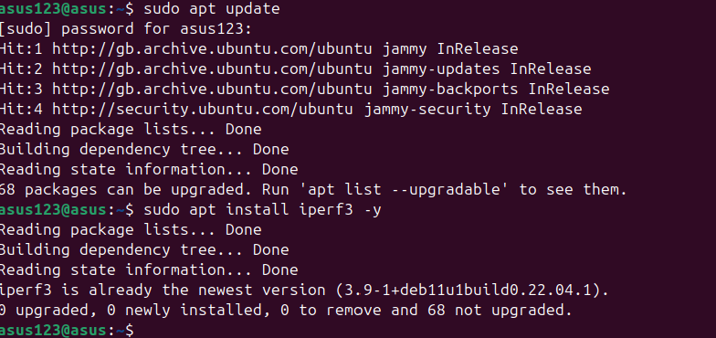

# Week 6 Journal: System Performance Benchmarking, Stress Testing, and Kernel Tuning  

# 1. Introduction & Objectives  
This week focused on evaluating system performance through benchmarking, stress testing, and kernel parameter optimization. The goal was to measure baseline performance, apply stress to key subsystems (CPU, memory, disk, network), and tune Linux kernel parameters to improve system responsiveness and resource management.  

# 2. Tools Used  
apache2-utils (ab) – Web server benchmarking  
stress-ng – System stress testing  
vmstat – Memory and process monitoring  
iostat – Disk I/O monitoring  
mpstat – CPU performance monitoring  
iperf3 – Network bandwidth testing  
dd – Disk performance testing  
sysctl – Kernel parameter tuning  

# 3. Baseline Performance Measurements  
Before applying stress, baseline metrics were collected for CPU, memory, and disk.  

Commands executed:
```
bash
mpstat 2 10 > cpu_baseline.txt
vmstat 2 10 > mem_baseline.txt
iostat -dx 2 10 > disk_baseline.txt
```
  

Output files created:
```
bash
ls -la *_test.txt *_baseline.txt
```
    


# 4. Web Server Benchmark with Apache Bench (ab)  
Apache Bench was used to test the performance of an Nginx web server running on 192.168.56.103.  

Installation check:
```
bash
sudo apt install apache2-utils -y
```
      

Benchmark execution:  
```
bash
ab -n 100 -c 5 http://192.168.56.103/ > webserver_test.txt
Requests per second: 3044.37

Concurrency level: 5

Time taken: 0.033 seconds
```

    
       


# 5. Memory Stress Test  
Attempted to stress memory using stress-ng, but encountered a typo in the command.  

Initial (failed) attempt:  
```
bash
stress-ng --vm 1 --nm-bytes 500M --timeout 30s &
Correct option is --vm-bytes, not --nm-bytes. The command was cancelled and memory was monitored using vmstat:
```
```
bash
vmstat 2 10 > memory_stress_test.txt
```
      

# 6. Disk I/O Stress Test  
Used dd to create a 300MB file and monitored disk I/O with iostat.  

Command with typo (corrected):
```
bash
dd if=/dev/zero of=/tmp/iotest bs=1M count=300 status=progress
Result: 463 MB/s write speed
```
        

I/O monitoring:
```
bash
iostat -dk 2 10 > disk_stress_test.txt
```
       

# 7. Network Performance Test with iperf3  
Attempted to measure network bandwidth between localhost and 192.168.56.103.  

Installation verified:  
```
bash
sudo apt install iperf3 -y
```
       

Test executed:  
```
bash
iperf3 -c 192.168.56.103 -t 10 -P 4 > network_test.txt
Encountered a socket error, possibly due to iperf3 server not running on the target.
```
 

# 8. Kernel Parameter Tuning  
# 8.1 Adjusting Swappiness  
Reduced swappiness from default 60 to 10 to decrease swapping tendency.  

Commands:
```
bash
sudo sysctl vm.swappiness=10
echo "vm.swappiness=10" | sudo tee -a /etc/sysctl.conf
cat /proc/sys/vm/swappiness
```
  

#8.2 TCP Stack Tuning  
Optimized TCP parameters for better network performance and connection handling.  

Changes made:  
tcp_fin_timeout: 60 → 30  
netdev_max_backlog: 1000 → 5000  
tcp_tw_reuse: Enabled (1)  

Commands and verification:  
```
bash
sudo sysctl -w net.ipv4.tcp_fin_timeout=30
sudo sysctl -w net.core.netdev_max_backlog=5000
sudo sysctl -w net.ipv4.tcp_tw_reuse=1
echo 'net.ipv4.tcp_fin_timeout=30' | sudo tee -a /etc/sysctl.conf
echo 'net.core.netdev_max_backlog=5000' | sudo tee -a /etc/sysctl.conf
echo 'net.ipv4.tcp_tw_reuse=1' | sudo tee -a /etc/sysctl.conf
sudo sysctl -p
```
   

# 9. Process Monitoring with top  
System processes were monitored using top to observe resource usage under normal conditions.  
    

# 10. Results Summary  
Metric	Baseline/Result	Stress Test/Observation  
CPU Idle (avg)	99.86%	Minimal change during stress  
Memory Free	~1.4 GB	Consistent during monitoring  
Disk Write Speed	463 MB/s	During dd write test  
Web Server RPS	3044.37 req/sec	Nginx performance  
Swappiness	10	Reduced from default 60  
TCP Timeout	30 sec	Reduced from 60 sec  

# 11. Analysis & Lessons Learned  
Typographical errors in commands (--nm-bytes, ls=/dev/zero) caused failed tests — attention to detail is critical.  
Network testing requires both client and server components (iperf3 -s on target).  
Kernel tuning can improve system responsiveness, but changes should be validated and documented.  
Baseline measurements are essential for comparing system performance before and after tuning or stress.  
Web server benchmarking with ab is effective for quick performance insights.  

# 12. Conclusion  
This week provided hands-on experience in system performance evaluation, stress testing, and kernel optimization. Key takeaways include the importance of accurate command execution, the value of baseline metrics, and the impact of kernel parameters on system behavior. The tuning applied (swappiness and TCP settings) should contribute to improved system performance under load.  

Evidence files created:  
cpu_baseline.txt, mem_baseline.txt, disk_baseline.txt, webserver_test.txt, memory_stress_test.txt, disk_stress_test.txt, network_test.txt

